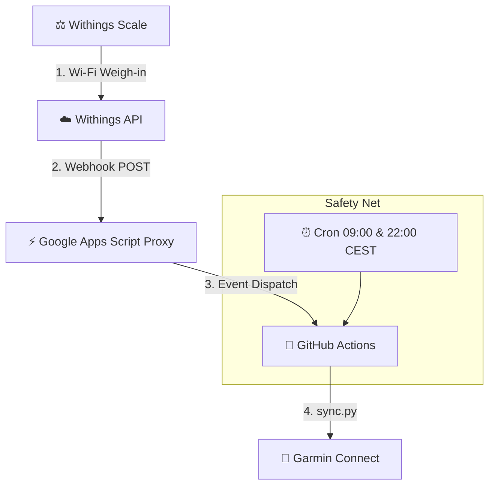

# ⚖️ Withings Body+ ➔ Garmin Connect

> **⚠️ SECURITY WARNING**: This template is designed to be used as a **PRIVATE** repository. The GitHub Actions workflow automatically commits your sensitive authentication tokens (`tokens.json` and `garth_session/`) back to the repository to keep your session alive. **If you make your fork public, anyone will have access to your Withings and Garmin accounts.**

Automatic and real-time synchronization (< 30s) of weigh-ins and body composition from a **Withings / Nokia Body+** scale to **Garmin Connect** (100% Cloud, 0€, 0 server).

---

## 🏗️ System Architecture



---

## 📊 Transmitted Metrics

| Withings Metric | Garmin Field | Calculation / Conversion |
|---|---|---|
| Weight | `weight` (kg) | Direct |
| Body Fat (%) | `percent_fat` | Direct (or auto calculation `fat_mass / weight`) |
| Muscle Mass | `muscle_mass` (kg) | Direct |
| Hydration (%) | `percent_hydration` | Auto conversion kg ➔ % |
| Bone Mass | `bone_mass` (kg) | Direct |

*Automatic catch-up of missed weigh-ins over the last 7 days.*

---

## 🚀 Quick Setup

### 1. GitHub Secrets
In your (private) GitHub repository: **Settings ➔ Secrets and variables ➔ Actions**:
- `WITHINGS_CLIENT_ID` / `WITHINGS_CLIENT_SECRET` / `WITHINGS_REFRESH_TOKEN`
- `GARMIN_EMAIL` / `GARMIN_PASSWORD`
- `WEBHOOK_URL` (optional: the Google Apps Script URL if you set up the real-time webhook below)

### 2. Real-Time Webhook (Google Apps Script)
1. Create a project on [Google Apps Script](https://script.google.com/) and paste this code:

```javascript
function doPost(e) {
  UrlFetchApp.fetch("https://api.github.com/repos/YOUR_GITHUB_USER/withings2garmin-sync/dispatches", {
    "method": "post",
    "headers": {
      "Authorization": "Bearer ghp_YOUR_GITHUB_PAT",
      "Accept": "application/vnd.github.v3+json"
    },
    "payload": JSON.stringify({"event_type": "withings_sync"}),
    "muteHttpExceptions": true
  });
  return ContentService.createTextOutput("OK");
}
function doGet(e) { return ContentService.createTextOutput("Active"); }
```

2. **Deploy** ➔ **New deployment** ➔ Web app:
   - Execute as: **Me**
   - Who has access: **Anyone**

---

## 🧪 Testing & Simulation

Test sending to Garmin without weighing yourself:
- **GitHub Actions**: **Actions** tab ➔ **Run workflow** ➔ Check `🧪 Simulate a fake weigh-in`.
- **Local terminal**: `python sync.py --simulate`

---

## ⏰ Operating Frequency

- **Instantaneous**: As soon as you step off the scale (< 30s via Webhook).
- **Safety Net**: Every day at 09:00 and 22:00 (Cron).
