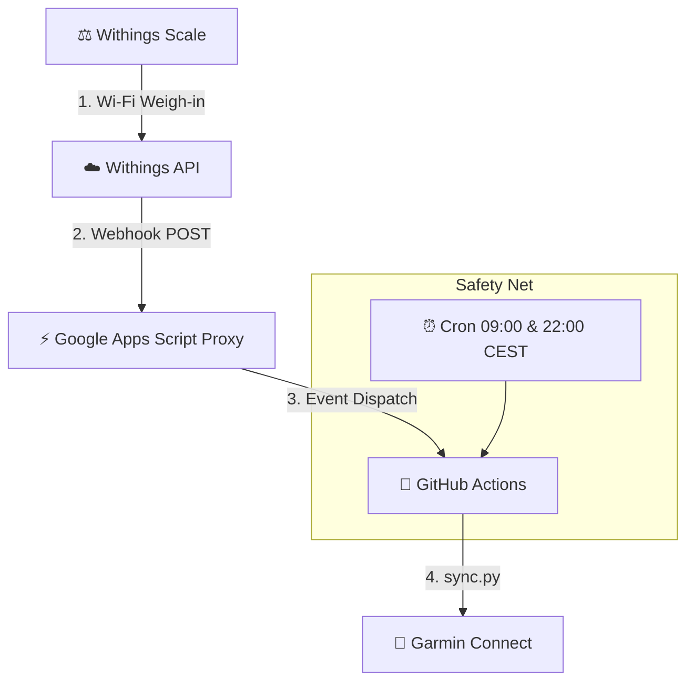

# ⚖️ Withings Smart Scales ➔ Garmin Connect

> **⚠️ SECURITY WARNING**: This template is designed to be used as a **PRIVATE** repository. The GitHub Actions workflow automatically commits your sensitive authentication tokens (`tokens.json` and `garth_session/`) back to the repository to keep your session alive. **If you make your fork public, anyone will have access to your Withings and Garmin accounts.**

Automatic and real-time synchronization (< 30s) of weigh-ins and body composition from **Withings / Nokia Smart Scales** (Body, Body+, Body Smart, Body Scan, Body Comp, Cardio) to **Garmin Connect** (100% Cloud, 0€, 0 server).

---

## 🏗️ System Architecture



---

## 📊 Transmitted Metrics

| Withings Metric | Garmin Field | Calculation / Conversion |
|---|---|---|
| Weight | `weight` (kg) | Direct |
| Body Fat (%) | `percent_fat` | Direct (or auto calculation `fat_mass / weight`) |
| Muscle Mass | `muscle_mass` (kg) | Direct |
| Hydration (%) | `percent_hydration` | Auto conversion kg ➔ % |
| Bone Mass | `bone_mass` (kg) | Direct |

*Automatic catch-up of missed weigh-ins over the last 7 days.*

---

## 🚀 Quick Setup

### 1. Create your Private Repository
1. Click the green **Use this template** button at the top of this repository (or create a new empty private repository and push this code).
2. ⚠️ **Set the repository visibility to Private** during creation so your tokens remain hidden.
3. Enable GitHub Actions write permissions: In your new private repo, go to **Settings ➔ Actions ➔ General ➔ Workflow permissions**, select **"Read and write permissions"**, and click **Save** (required for persisting sessions across runs).

### 2. GitHub Secrets
In your private GitHub repository, go to **Settings ➔ Secrets and variables ➔ Actions** and add the following secrets:

#### Garmin Credentials
- **`GARMIN_EMAIL`**: The email address you use to log into Garmin Connect.
- **`GARMIN_PASSWORD`**: Your Garmin Connect password.

#### Withings API Credentials
To get your Withings Client ID and Secret, you need to create a free developer app:
1. Go to the [Withings Developer Portal](https://developer.withings.com/developer-guide/v3/integration-guide/public-api/getting-started) and log in.
2. Go to your Dashboard and click **Create an app**.
3. Fill in the required fields (Name, Description). For the **Callback URI**, enter `https://example.com` (this is just a placeholder needed for the setup).
4. Once created, you will get your **`WITHINGS_CLIENT_ID`** and **`WITHINGS_CLIENT_SECRET`**. Add both to your GitHub Secrets.

#### Withings Refresh Token (`WITHINGS_REFRESH_TOKEN`)
You need to generate an initial token so the script can access your personal data. The script will automatically renew it afterward.
1. Open this URL in your web browser (replace `YOUR_CLIENT_ID` with the ID you just got):
   `https://account.withings.com/oauth2_user/authorize2?response_type=code&client_id=YOUR_CLIENT_ID&state=init&scope=user.metrics,user.info&redirect_uri=https://example.com`
2. Log in and allow access. You will be redirected to a page that might look broken at `example.com`.
3. Look at the URL in your browser's address bar. It will look like: `https://example.com/?code=YOUR_AUTHORIZATION_CODE&state=init`. Copy the `YOUR_AUTHORIZATION_CODE` value.
4. Open a terminal and run the following command (replace the 3 placeholders with your actual values):
   ```bash
   curl --request POST 'https://wbsapi.withings.net/v2/oauth2' \
     --data-urlencode 'action=requesttoken' \
     --data-urlencode 'grant_type=authorization_code' \
     --data-urlencode 'client_id=YOUR_CLIENT_ID' \
     --data-urlencode 'client_secret=YOUR_CLIENT_SECRET' \
     --data-urlencode 'code=YOUR_AUTHORIZATION_CODE' \
     --data-urlencode 'redirect_uri=https://example.com'
   ```
5. In the JSON response printed in your terminal, find the `"refresh_token"` string. Add this exact string as your **`WITHINGS_REFRESH_TOKEN`** GitHub Secret.

#### Webhook URL
- **`WEBHOOK_URL`** *(Optional)*: If you want real-time syncing, set up the Google Apps Script as described in Step 2 below. Once you click "Deploy", Google will give you a **Web app URL**. Save this URL as your `WEBHOOK_URL` secret.

### 3. Real-Time Webhook (Google Apps Script)
1. Create a project on [Google Apps Script](https://script.google.com/) and paste this code:

```javascript
function doPost(e) {
  UrlFetchApp.fetch("https://api.github.com/repos/YOUR_GITHUB_USER/withings2garmin-sync/dispatches", {
    "method": "post",
    "headers": {
      "Authorization": "Bearer ghp_YOUR_GITHUB_PAT",
      "Accept": "application/vnd.github.v3+json"
    },
    "payload": JSON.stringify({"event_type": "withings_sync"}),
    "muteHttpExceptions": true
  });
  return ContentService.createTextOutput("OK");
}
function doGet(e) { return ContentService.createTextOutput("Active"); }
```

2. **Deploy** ➔ **New deployment** ➔ Web app:
   - Execute as: **Me**
   - Who has access: **Anyone**

---

## 🧪 Testing & Simulation

Test sending to Garmin without weighing yourself:
- **GitHub Actions**: **Actions** tab ➔ **Run workflow** ➔ Check `🧪 Simulate a fake weigh-in`.
- **Local terminal**: `python sync.py --simulate`

---

## ⏰ Operating Frequency

- **Instantaneous**: As soon as you step off the scale (< 30s via Webhook).
- **Safety Net**: Every day at 09:00 and 22:00 (Cron).
